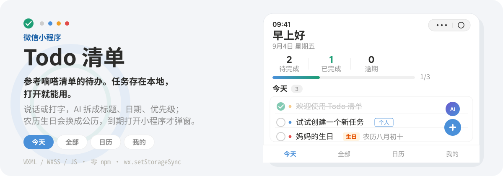
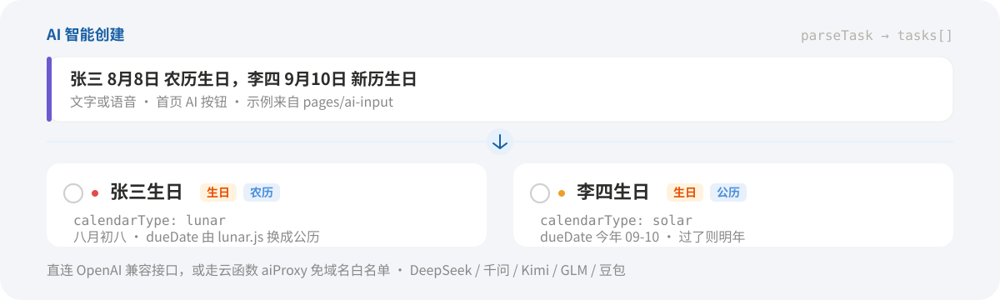
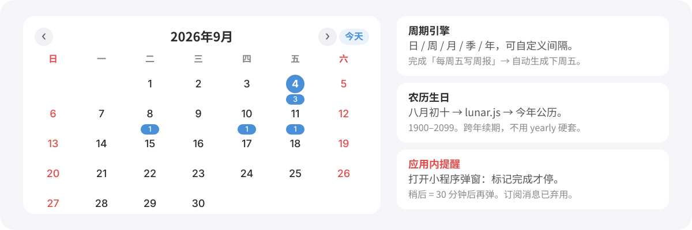

<p align="center">
  
</p>

打开就能勾今天的事。任务存在 `wx.setStorageSync`，**不上传**。原生 WXML / WXSS / JS，没有 npm 依赖，图标也是 CSS 画的。

想少点几下，到「我的 → 设置」填一个 OpenAI 兼容的 Key。首页 AI 按钮能把一句话拆成标题、日期、优先级、分类；农历生日会写成农历字段，再换成今年的公历 `dueDate`。

<p align="center">
  
</p>

## 这是什么

参考嘀嗒清单的待办小程序。四个 tab：

| Tab | 做什么 |
| --- | --- |
| 今天 | 今天到期 + 逾期，进度条，点圆圈完成 |
| 全部 | 按日期分组，可搜索、按状态筛选 |
| 日历 | 月视图，格子上是任务数；点一天看当天 |
| 我的 | 完成数、连续打卡、今日进度，以及 AI 设置 |

新建任务有四级优先级（无 / 低 / 中 / 高）、日期时间、分类。默认分类是收件箱、个人、工作、购物。首次启动会写入三条示例任务。

## 和普通待办清单不同的三件事

1. **数据不出手机。** CRUD 都在 `utils/store.js`，走 `wx.setStorageSync`。没有登录，也没有云库。
2. **农历生日按农历存。** `isBirthday` + `calendarType: lunar` 记下月、日、闰月；`lunar.js`（1900–2099）换成今年公历。跨年由生日引擎续期，不把生日写成 `yearly` 周期去硬套。
3. **AI 可以不配服务器域名。** 直连第三方（要在公众平台配 request 合法域名），或把「AI 调用方式」切到云函数，只部署 `cloudfunctions/aiProxy`。小程序只调 `wx.cloud.callFunction`，微信自己的域名，免白名单。厂商预设：DeepSeek / 通义千问 / Kimi / 智谱 GLM / 豆包 / OpenAI。

周期是日 / 周 / 月 / 季 / 年，可自定义间隔；季度支持「第 N 周周 M」。完成一条周期任务会生成下一期实例。切日历月份时，会把逾期的周期和生日补出来。

<p align="center">
  
</p>

## 提醒怎么工作

微信订阅消息做过完整链路（云函数定时推），**已经弃用**。一次性授权每次只能推 1 条，个人主体申请不了长期订阅，体验版限制也多。

现在只做**应用内提醒**：到点之后，打开小程序或回到前台会 `wx.showModal`。

- **标记完成** — 任务完成，提醒停
- **稍后提醒** — 30 分钟后再弹

不依赖服务器。`cloudfunctions/pushReminders`、`cloudfunctions/syncReminders`、`utils/push.js` 留在仓库里当参考，不再维护。部署备忘见 [推送部署说明.md](./推送部署说明.md)。

## 跑起来

1. 打开[微信开发者工具](https://developers.weixin.qq.com/miniprogram/dev/devtools/download.html) → 导入项目
2. 目录选仓库根（`miniprogramRoot` 已指向 `miniprogram/`），填你的 AppID
3. 编译运行。无需安装依赖；第一次启动会生成示例任务

### AI（可选）

「我的 → 设置」：

1. 点厂商预设，自动填 API 地址和默认模型
2. 填 API Key（存在本地）
3. 点「测试连接」，回到首页点 AI

自用、不想配域名：调用方式改成**云函数**，填云环境 ID，把 `cloudfunctions/aiProxy` 上传部署。

语音走 `wx.getRecorderManager`，识别仍经过同一个 `parseTask`。

试试这些（设置页和 AI 页里也有）：

```text
明天下午3点开会
每周五提醒写周报
每季度第二周前报税
妈妈的生日 农历八月初十
张三 8月8日 农历生日，李四 9月10日 新历生日
```

## 目录

```
miniprogram/
├── pages/           今天 / 全部 / 日历 / 新建 / 详情 / 我的 / AI / 设置
├── components/      task-item · empty-state · recurrence-picker
└── utils/
    ├── store.js     本地 CRUD
    ├── ai.js        意图识别，直连或云函数
    ├── recurring.js 周期
    ├── lunar.js     农历 1900–2099
    ├── reminder.js  应用内弹窗
    └── voice.js     录音
cloudfunctions/aiProxy/   可选，免域名白名单
```

页面路由在 `miniprogram/app.json`。样式变量在 `miniprogram/app.wxss`：主色 `#4A90D9`，完成勾 `#1D9E75`。

## 版本

| 版本 | 内容 |
|------|------|
| v1.0.0 | 基础任务（CRUD / 优先级 / 分类 / 统计） |
| v2.0 | AI 创建、周期、农历生日、语音 |
| v3.0 | 多厂商预设、季度规则、日历、提醒引擎 |
| v3.1 | 多人多任务解析、农历生日自动续期；订阅消息推送后弃用 |
